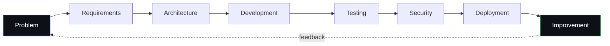
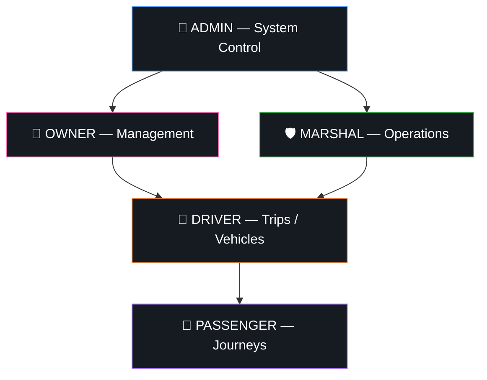
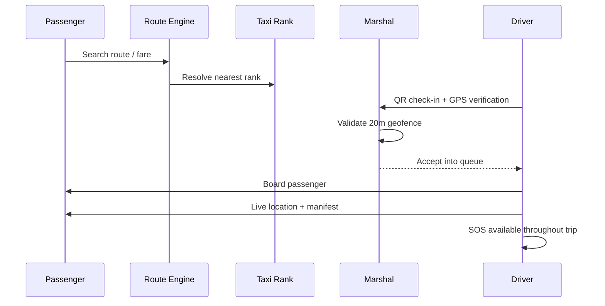
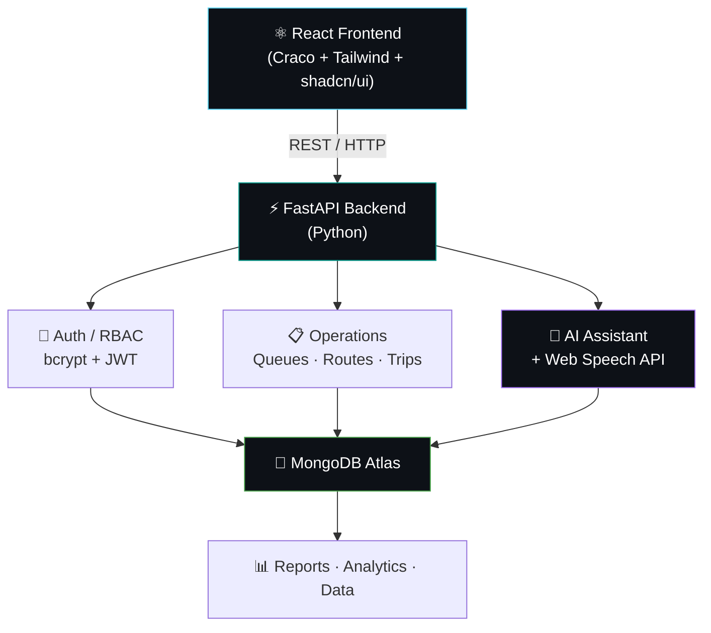
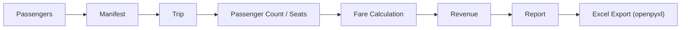
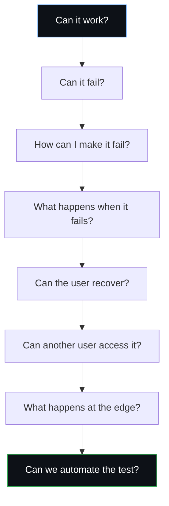
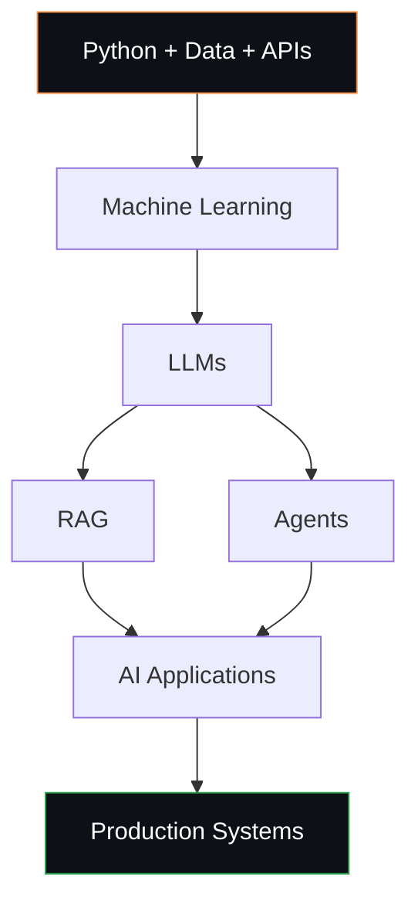
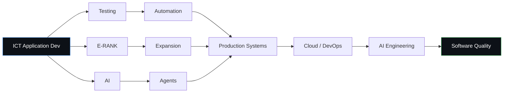

<div align="center">


<a href="https://github.com/YOUR-USERNAME">
  
</a>

<br/>


</div>

<br/>

<!-- ============================================================ -->
<!-- 01 / THE ENGINEER -->
<!-- ============================================================ -->

## 🧠 01 · The Engineer

<table>
<tr>
<td width="60%" valign="top">

**I build software around problems — not just technologies.**

I'm an ICT Application Development student and software builder from South Africa. My interests sit at the intersection of several engineering disciplines:

- ⚙️ **Software Engineering** — architecture, requirements, lifecycle thinking
- 🤖 **AI Engineering** — LLMs, RAG, agents, intelligent workflows
- 🧪 **Software Testing & Quality** — functional, negative, boundary, regression
- 🔁 **Automation** — reducing repetitive work through tooling
- 🔐 **Cybersecurity** — auth, RBAC, secure-by-design systems
- 🗄️ **Database Systems** — modeling real operational domains
- 🌍 **Real-World Information Systems** — software that understands its environment

I think in terms of the **full software lifecycle**:



</td>
<td width="40%" valign="top">

**Engineering Lab — Current Focus**

```text
SOFTWARE ENGINEERING   ████████████████░░░░  ACTIVE
SOFTWARE TESTING       ███████████████░░░░░  ACTIVE
E-RANK                 █████████████████░░░  ACTIVE
AUTOMATION             ██████████████░░░░░░  ACTIVE
AI ENGINEERING         ████████████░░░░░░░░  LEARNING
CYBERSECURITY          ███████████░░░░░░░░░  LEARNING
CLOUD / DEVOPS         ████████░░░░░░░░░░░░  EXPLORING
```

</td>
</tr>
</table>

<br/>

<!-- ============================================================ -->
<!-- 02 / FLAGSHIP PROJECT -->
<!-- ============================================================ -->

## 🚕 02 · Flagship System — E-RANK

<div align="center">


</div>

> A **taxi-rank management and operations platform** designed around the South African minibus taxi industry — digitizing rank operations across five distinct roles: **Admin, Owner, Marshal, Driver, Passenger.**

E-RANK began as an academic group project. I developed the core concept, product direction, and UX approach, while continuing to push it beyond its original academic scope.

### The Five-Role Architecture



### System in Motion



<table>
<tr>
<th>🚦 Operations</th>
<th>👥 Passengers</th>
<th>🛡️ Safety</th>
</tr>
<tr>
<td valign="top">

- Live taxi queues
- Rank management
- QR rank check-ins
- GPS verification
- Driver operations
- Route & fare management

</td>
<td valign="top">

- Route & fare discovery
- Digital manifests
- Next-of-kin details
- Journey sharing
- Live location sharing
- Public rank information

</td>
<td valign="top">

- SOS alerts
- GPS geofencing (20m radius)
- Role-based permissions
- Authentication
- Credential protection
- Queue integrity

</td>
</tr>
</table>

### Architecture



<div align="center">

| Layer | Technology |
|---|---|
| **Frontend** | React + Craco, Tailwind CSS, shadcn/ui |
| **Backend** | FastAPI (Python) |
| **Database** | MongoDB Atlas |
| **Auth** | bcrypt + PyJWT |
| **Maps** | Google Maps |
| **Location** | Browser Geolocation API |
| **QR** | HTML5 QR Code |
| **AI / Voice** | AI Assistant + Web Speech API |
| **Reporting** | openpyxl |
| **Deployment** | Render |

</div>

### Security Engineering

<div align="center">


</div>

### Revenue & Reporting Flow



<br/>

<!-- ============================================================ -->
<!-- 03 / QUALITY ENGINEERING -->
<!-- ============================================================ -->

## 🧪 03 · Quality Engineering

**BUILD → BREAK → TEST → FIX → REPEAT**

Testing isn't an afterthought — it's part of how I think about design from day one.



<div align="center">

`Functional` `Regression` `Integration` `API Testing` `UI Testing` `Database Testing` `Boundary Testing` `Negative Testing` `Defect Investigation` `Test Automation` `CI/CD Quality Gates`

</div>

E-RANK's repository includes dedicated `tests/`, `test_reports/`, and an `eRANK_Test_Cases.xlsx` artifact — testing is treated as a first-class engineering deliverable, not a checkbox.

<br/>

<!-- ============================================================ -->
<!-- 04 / AI ENGINEERING LAB -->
<!-- ============================================================ -->

## 🤖 04 · AI Engineering Lab



**Current exploration:** LLM applications · AI agents · RAG systems · AI-assisted automation · intelligent APIs · voice interfaces · production AI architecture.

<br/>

<!-- ============================================================ -->
<!-- 05 / PROJECT LAB -->
<!-- ============================================================ -->

## 📁 05 · Project Lab

<table>
<tr>
<td width="50%">

### 🚕 E-RANK
**Transport Technology**
Taxi rank management and operations platform.
`React` `FastAPI` `MongoDB` `JWT` `GPS` `QR` `AI`


</td>
<td width="50%">

### 🤖 AI Trading System
**AI / Automation**
Experimental automated market-analysis and decision-support project.
`Python` `Automation` `Data`


</td>
</tr>
<tr>
<td width="50%">

### 🍽️ Dilostofong RMS
**Business Systems**
Restaurant management system.
`Java` `MySQL` `NetBeans`


</td>
<td width="50%">

### 🏠 Student Accommodation
**Information Systems**
A platform concept for helping students discover accommodation.
`Web` `Database` `Systems`


</td>
</tr>
</table>

<br/>

<!-- ============================================================ -->
<!-- 06 / TECHNOLOGY MATRIX -->
<!-- ============================================================ -->

## 🛠️ 06 · Technology Matrix

<div align="center">


</div>

<br/>

<!-- ============================================================ -->
<!-- 07 / GITHUB TELEMETRY -->
<!-- ============================================================ -->

## 📡 07 · GitHub Telemetry

<div align="center">


<br/>


<br/><br/>


<br/>

### Contribution Graph (animated)


</div>

> **Note:** The stats/streak/trophy widgets and the snake contribution graph above pull live data from GitHub the moment your README is viewed — they render automatically once you replace `YOUR-USERNAME` and set up the tiny "snake" GitHub Action below. No JavaScript required; GitHub renders them as dynamic SVGs.

<br/>

<!-- ============================================================ -->
<!-- 08 / ROADMAP -->
<!-- ============================================================ -->

## 🗺️ 08 · The Road Ahead



**My direction:** Software Engineering → Software Testing → Test Automation → AI Engineering → Production Systems → Intelligent Software

<br/>

<!-- ============================================================ -->
<!-- 09 / BUILD PHILOSOPHY -->
<!-- ============================================================ -->

## 📜 09 · Build Philosophy

<table>
<tr><td>01</td><td>Real problems over toy problems.</td></tr>
<tr><td>02</td><td>Understand the user before writing the code.</td></tr>
<tr><td>03</td><td>Architecture before complexity.</td></tr>
<tr><td>04</td><td>Security from the beginning.</td></tr>
<tr><td>05</td><td>Test what you build.</td></tr>
<tr><td>06</td><td>Automate repetitive work.</td></tr>
<tr><td>07</td><td>Use AI where it creates real value.</td></tr>
<tr><td>08</td><td>Learn the fundamentals behind the tools.</td></tr>
<tr><td>09</td><td>Build → Break → Learn → Improve.</td></tr>
<tr><td>10</td><td>Every project should teach something.</td></tr>
</table>

<br/>

<!-- ============================================================ -->
<!-- 10 / CONNECT -->
<!-- ============================================================ -->

## 📫 10 · Connect

<div align="center">

<a href="https://linkedin.com/in/YOUR-LINKEDIN"></a>
<a href="mailto:YOUR-EMAIL"></a>
<a href="https://github.com/YOUR-USERNAME"></a>

<br/><br/>

**BUILDING SYSTEMS. TESTING IDEAS. AUTOMATING WORK. ENGINEERING THE NEXT VERSION.**

FROM SOUTH AFRICA 🇿🇦 — BUILDING TOWARD THE FUTURE.


</div>
