

 

  

 

## 🧠 The Engineer

<table>
<tr>
<td width="58%" valign="top">

**I don't only ask "can I build it?" — I ask who it's for, what can break it, and how it survives contact with reality.**

I'm an **ICT Application Development** student and software builder from South Africa, working at the intersection of:

     

I think in full lifecycles, not isolated features — every system I touch moves through the same discipline:

</td>
<td width="42%" valign="top">

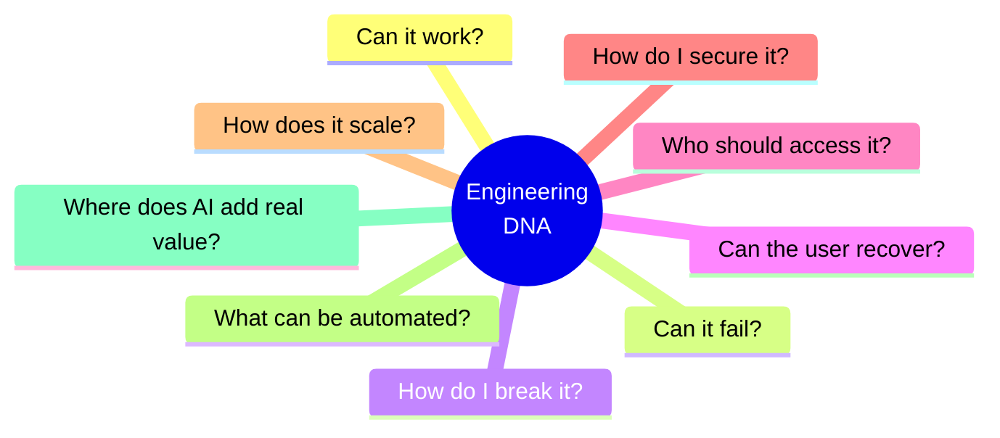

</td>
</tr>
</table>

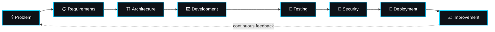

 

## 🚕 Flagship System — E-RANK

> A **taxi-rank management and operations platform** built around the real-world logic of South Africa's minibus taxi industry — digitizing operations across five distinct roles. I originated the concept, product direction, and UX approach, and continue pushing it beyond its original academic scope.

### The Five-Role Architecture

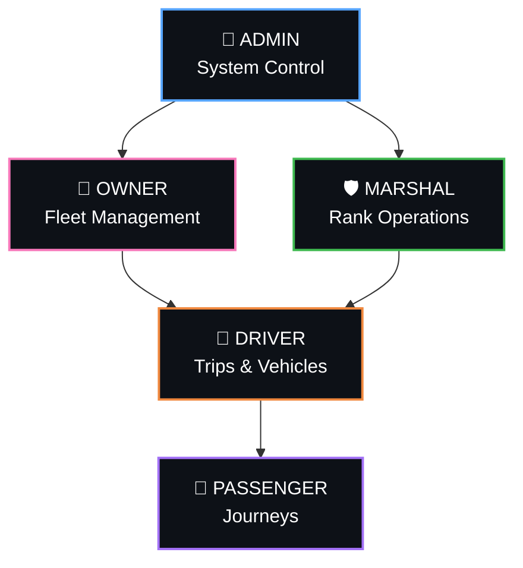

### Live Operations Sequence

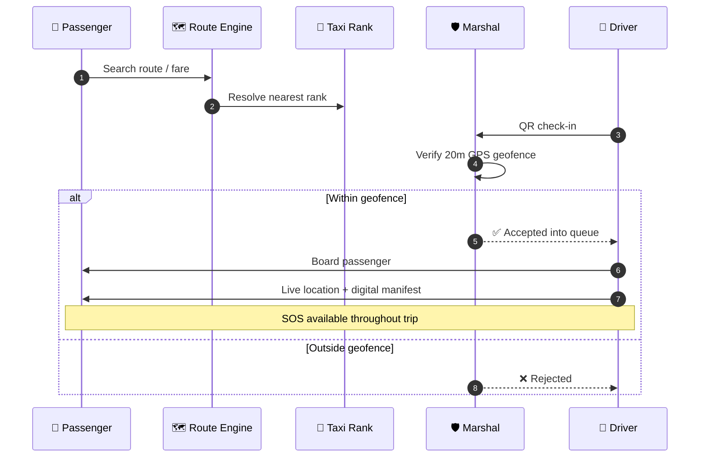

### Passenger Journey

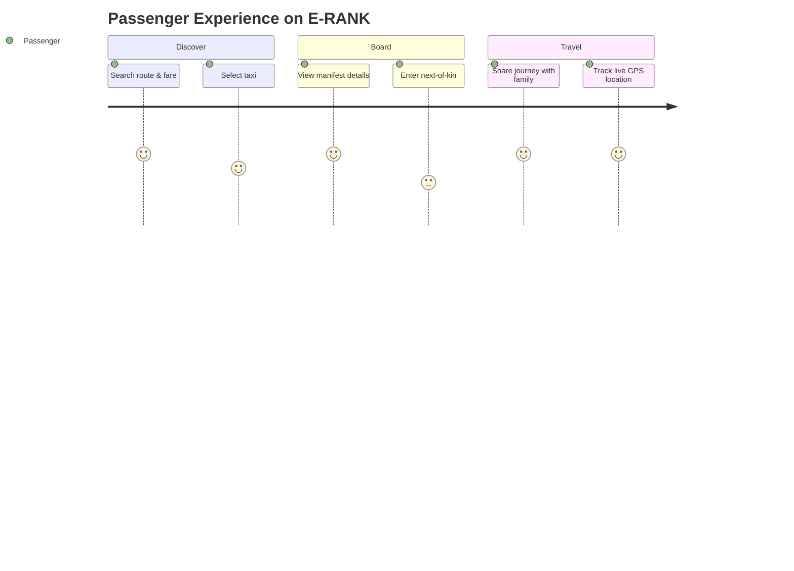

<table>
<tr><th>🚦 Operations</th><th>👥 Passengers</th><th>🛡️ Safety</th></tr>
<tr>
<td valign="top">

- Live taxi queues
- Rank management
- QR rank check-ins
- GPS verification
- Driver operations
- Route & fare management

</td>
<td valign="top">

- Route & fare discovery
- Digital manifests
- Next-of-kin details
- Journey sharing
- Live location sharing
- Public rank information

</td>
<td valign="top">

- SOS alerts
- 20m GPS geofencing
- Role-based permissions
- Authentication
- Credential protection
- Queue integrity

</td>
</tr>
</table>

### System Architecture

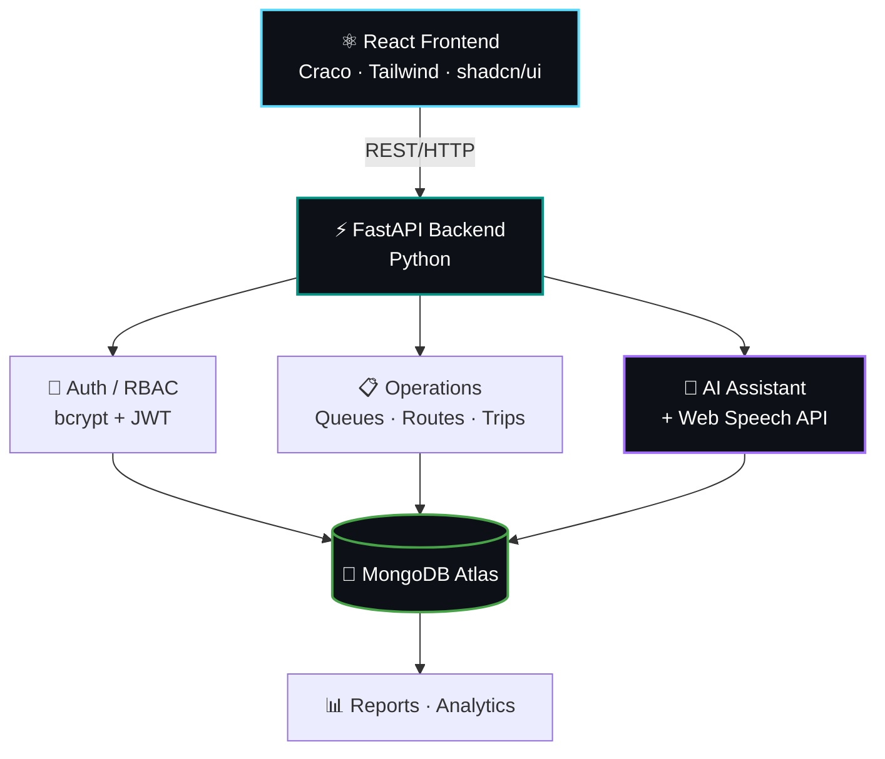

| Layer | Technology |
|---|---|
| **Frontend** | React + Craco, Tailwind CSS, shadcn/ui |
| **Backend** | FastAPI (Python) |
| **Database** | MongoDB Atlas |
| **Auth** | bcrypt + PyJWT |
| **Maps** | Google Maps |
| **Location** | Browser Geolocation API |
| **QR** | HTML5 QR Code |
| **AI / Voice** | AI Assistant + Web Speech API |
| **Reporting** | openpyxl |
| **Deployment** | Render |

### Security Layer

### Revenue Pipeline

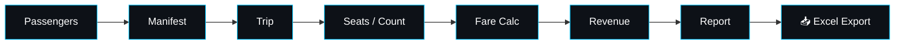

 

## 🧪 Quality Engineering

**BUILD → BREAK → TEST → FIX → REPEAT**

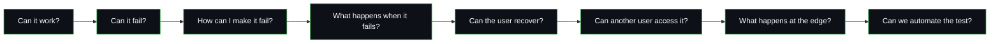

`Functional` `Regression` `Integration` `API Testing` `UI Testing` `Database Testing` `Boundary Testing` `Negative Testing` `Defect Investigation` `Test Automation` `CI/CD Quality Gates`

E-RANK ships with dedicated `tests/`, `test_reports/`, and an `eRANK_Test_Cases.xlsx` artifact — testing is a first-class deliverable, not a checkbox.

 

## 🤖 AI Engineering Lab

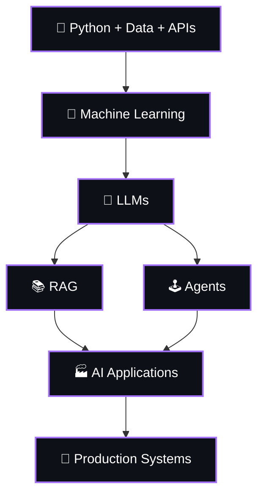

**Current exploration:** LLM applications · AI agents · RAG systems · AI-assisted automation · intelligent APIs · voice interfaces · production AI architecture.

 

## 📁 Project Lab

<table>
<tr>
<td width="50%" valign="top">

### 🚕 E-RANK
**Transport Technology**
Taxi rank management and operations platform.
`React` `FastAPI` `MongoDB` `JWT` `GPS` `QR` `AI`

</td>
<td width="50%" valign="top">

### 🤖 AI Trading System
**AI / Automation**
Experimental automated market-analysis and decision-support project.
`Python` `Automation` `Data`

</td>
</tr>
<tr>
<td width="50%" valign="top">

### 🍽️ Dilostofong RMS
**Business Systems**
Restaurant management system.
`Java` `MySQL` `NetBeans`

</td>
<td width="50%" valign="top">

### 🏠 Student Accommodation
**Information Systems**
A platform concept for helping students discover accommodation.
`Web` `Database` `Systems`

</td>
</tr>
</table>

 

## 🛠️ Technology Arsenal

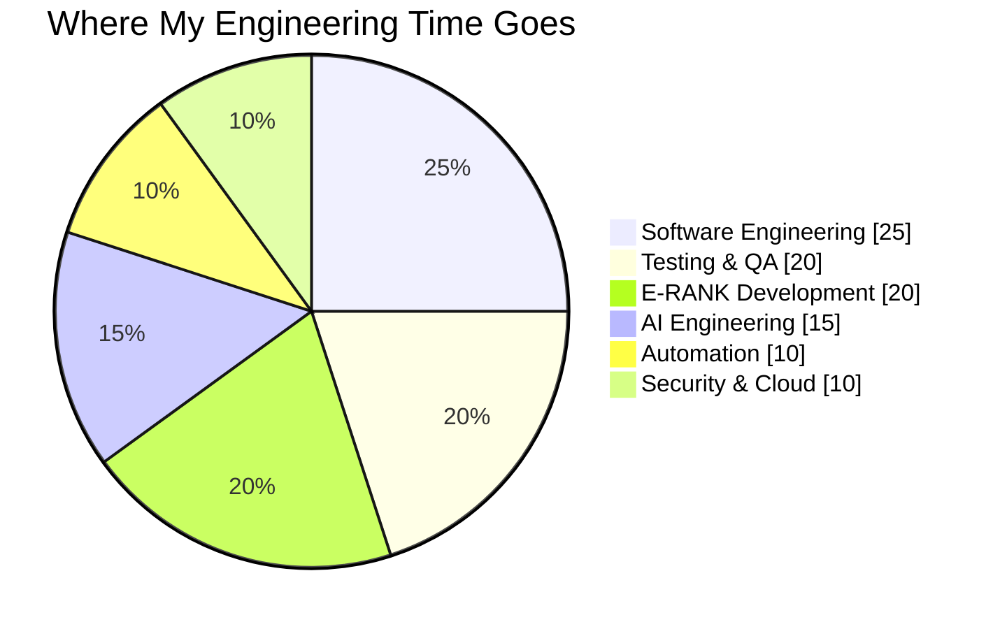

 

## 📡 GitHub Telemetry

 

  

  

  

### 🌆 3D Contribution Skyline

 

### 🐍 The Snake Eats My Commits

> **Setup required (one-time, ~10 min total):** these widgets pull *live* data straight from your GitHub — none of it is faked. Full steps are in the checklist at the bottom.

 

## 🗺️ The Road Ahead

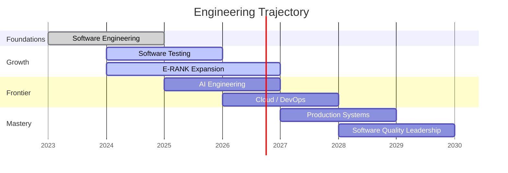

**My direction:** Software Engineering → Software Testing → Test Automation → AI Engineering → Production Systems → Intelligent Software.

 

## 📜 Build Philosophy

| # | Principle |
|:---:|---|
| 01 | Real problems over toy problems |
| 02 | Understand the user before writing the code |
| 03 | Architecture before complexity |
| 04 | Security from the beginning |
| 05 | Test what you build |
| 06 | Automate repetitive work |
| 07 | Use AI where it creates real value |
| 08 | Learn the fundamentals behind the tools |
| 09 | Build → Break → Learn → Improve |
| 10 | Every project should teach something |

 

## 📫 Connect

  

**BUILDING SYSTEMS. TESTING IDEAS. AUTOMATING WORK. ENGINEERING THE NEXT VERSION.**

FROM SOUTH AFRICA 🇿🇦 — BUILDING TOWARD THE FUTURE.

 

<b>⚙️ Setup checklist — do this before pushing (10 minutes, one time)</b>

 

1. **Repo name:** create a repo named *exactly* your GitHub username (e.g. `kholofelo/kholofelo`) — that's what turns a README into your GitHub profile page.
2. **Find & replace:** swap every `YOUR-USERNAME`, `YOUR-LINKEDIN`, and `YOUR-EMAIL` in this file for your real ones.
3. **Snake contribution graph:** add the free [Platane/snk](https://github.com/Platane/snk) GitHub Action to this repo — it generates the `output/github-contribution-grid-snake-dark.svg` this file links to.
4. **3D contribution skyline:** add the free [yoshi389111/github-profile-3d-contrib](https://github.com/yoshi389111/github-profile-3d-contrib) Action — it generates the `profile-3d-contrib` branch and SVG this file links to.
5. **Mermaid diagrams:** render natively on github.com — no setup needed, just push.
6. Everything else (stats, streak, trophies, activity graph, skill icons, badges, view counter) is a live external image — it updates itself automatically, nothing to maintain.

